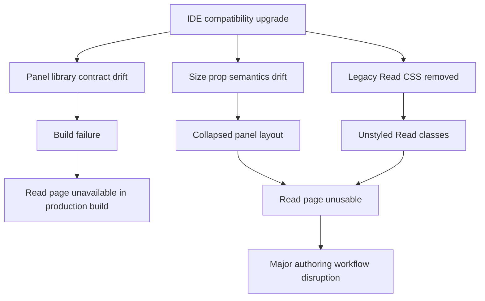

# IDE Compatibility Incident Report

## 1. Issue Summary

**Incident:** Read IDE visual and layout system broke after infrastructure/library compatibility changes.

**Primary symptoms:**
- `npm run build` failed with a module export error for panel components.
- Read page layout collapsed (sidebar width/structure broken).
- Read page visual system regressed due missing style coverage after CSS migration.
- Visual regression baseline no longer matched expected snapshots.

**Severity:** High  
**Scope:** Read/Truesight authoring workflow (`/read`)  
**Date (fix window):** February 11, 2026

---

## 2. Root Cause Analysis

### 2.1 Technical Root Causes

#### Root Cause A: Third-party API contract change (panel library)
The installed `react-resizable-panels` build exports:
- `Group`
- `Panel`
- `Separator`

The application imported legacy names:
- `PanelGroup`
- `PanelResizeHandle`

That mismatch caused a hard build failure:

```text
"PanelGroup" is not exported by "react-resizable-panels"
```

#### Root Cause B: Sizing semantics mismatch after compatibility migration
`Group/Panel` interpreted numeric size props as fixed units for this version path, while Read page code relied on percentage behavior.  
Result: panel sizes collapsed into near-zero/incorrect widths.

#### Root Cause C: CSS coverage gap after migration
`src/pages/Read/ReadPage.css` had been removed while current JSX still depended on many of its selectors.  
The replacement `src/pages/Read/IDE.css` only defined a minimal shell, leaving many live classes effectively unstyled.

#### Root Cause D: Encoding artifact in UI labels (secondary quality issue)
Some symbols in `src/components/RhymeSchemePanel.jsx` were mojibake-corrupted, producing degraded panel UI text/icons.

---

### 2.2 Causal Diagram



---

## 3. Impact Assessment

### 3.1 Functional Impact
- Build pipeline blocked for production bundle generation.
- `/read` authoring workflow degraded:
  - sidebar/list visibility and structure broken,
  - editor presentation and Truesight panels inconsistent,
  - visual hierarchy and usability regressed.

### 3.2 Product Impact
- Core poetry-writing/analysis flow became unreliable.
- Team confidence in IDE-compatibility rollout reduced.
- Snapshot-based QA became noisy until baseline reconciliation.

### 3.3 Severity Rationale
- **High** because it impacted both build integrity and primary user-facing workflow.

---

## 4. Resolution Steps

## 4.1 Code Changes Applied

### A. Panel API compatibility fix
**File:** `src/pages/Read/ReadPage.jsx`

```jsx
import {
  Group as PanelGroup,
  Panel,
  Separator as PanelResizeHandle,
} from "react-resizable-panels";
```

### B. Correct panel size units
**File:** `src/pages/Read/ReadPage.jsx`

Converted panel sizes to explicit percentages:

```jsx
<Panel defaultSize={isNarrowViewport ? "28%" : "20%"} minSize={isNarrowViewport ? "20%" : "15%"} />
<Panel minSize={isNarrowViewport ? "40%" : "30%"} />
```

### C. Restore full Read styling coverage
**File:** `src/pages/Read/IDE.css` (recreated and expanded)

Implemented full style coverage for active Read classes:
- layout shell,
- scroll list/sidebar,
- toolbar modes/dropdowns,
- editor/read-only/truesight overlay,
- rhyme scheme/diagram/vowel panels,
- light mode + responsive behavior.

### D. Stabilize long-content editor auto-height
**File:** `src/pages/Read/ScrollEditor.jsx`

Added buffer to prevent rounding overflow in regression test path:

```jsx
const measuredHeight = Math.max(MIN_EDITOR_HEIGHT, textarea.scrollHeight + 8);
```

### E. Clean corrupted panel symbols
**File:** `src/components/RhymeSchemePanel.jsx`

Replaced corrupted mojibake controls/labels with ASCII-safe equivalents.

### F. Vowel-family metadata correctness
**File:** `src/pages/Read/ReadPage.jsx`

Added explicit school glyph/name mapping from vowel families so panel rows are complete and deterministic.

---

## 4.2 Rollback Procedure

If immediate rollback is required:

```bash
# 1) identify known-good commit
git log --oneline

# 2) create rollback branch
git checkout -b rollback/read-ide-incident

# 3) revert specific commits (preferred)
git revert <commit_sha_1> <commit_sha_2> ...

# 4) verify
npm run build
npx playwright test tests/visual/read-layout-regression.spec.js --project=chromium --workers=1
```

Emergency hard rollback (only with explicit approval and backup policy):

```bash
git checkout <known_good_tag_or_sha>
```

---

## 5. Verification

## 5.1 Automated Validation Executed

### Build
```bash
npm run build
```
**Result:** Passed.

### Read layout regression checks
```bash
npx playwright test tests/visual/read-layout-regression.spec.js --project=chromium --workers=1 --reporter=line
```
**Result:** Passed.

### Scroll editor save behavior
```bash
npx playwright test tests/visual/scroll-editor.spec.js --project=chromium --workers=1 --reporter=line
```
**Result:** Passed.

### Read snapshot
```bash
npx playwright test tests/visual/read-page.spec.js --project=chromium --workers=1 --reporter=line
```
**Result:** Functional rendering passes, snapshot mismatch remains expected until baseline update.

---

## 5.2 Success Criteria (Measurable)

Fix is considered complete when all criteria are true:

1. `npm run build` exits with code `0`.
2. Read layout regression suite passes in CI.
3. Scroll editor save interaction test passes in CI.
4. No panel import/export errors in build logs.
5. `/read` sidebar and editor panes render with expected dimensions on desktop and mobile breakpoints.
6. Snapshot baseline is either:
   - updated and approved, or
   - unchanged with pixel diff < agreed threshold for accepted changes.

---

## 6. Preventative Measures

### 6.1 Dependency Contract Safeguards
- Add a lightweight compatibility test asserting required exports from critical libraries:
  - `react-resizable-panels` must expose expected symbols.
- Pin major/minor versions for UI-infrastructure dependencies unless upgrade playbook is followed.

### 6.2 CI Gating
- Make these mandatory on PRs touching `/read` or layout libs:
  - `npm run build`
  - `tests/visual/read-layout-regression.spec.js`
  - `tests/visual/scroll-editor.spec.js`

### 6.3 Upgrade Playbook
- For every UI infra upgrade:
  - run API diff check,
  - run visual/layout smoke tests,
  - run focused manual checklist on `/read`,
  - explicitly validate sizing semantics (percent vs px).

### 6.4 CSS Coverage Guard
- Add static check that core Read JSX class names have corresponding selectors in Read CSS modules.
- Fail CI when high-priority Read selectors become orphaned.

### 6.5 Encoding Hygiene
- Add pre-commit/CI scan for mojibake patterns and invalid UTF transformations in JSX/CSS.

### 6.6 Snapshot Governance
- Require explicit baseline update PR annotation:
  - reason for visual change,
  - diff review screenshots,
  - approver sign-off.

---

## 7. Reproduction & Resolution Runbook (AI-Team Actionable)

## 7.1 Reproduce Failure

```bash
npm ci
npm run build
# observe missing export error for panel symbols
```

Open `/read` and observe:
- malformed panel sizing,
- missing styling coverage if IDE.css is minimal.

## 7.2 Apply Fix Pattern

1. Align imports to actual library exports (`Group`, `Separator` aliases).
2. Convert panel sizes to explicit percentage strings.
3. Restore full selector coverage for active JSX classes.
4. Re-run build and focused visual tests.

---

## 8. Glossary

- **API Contract Drift:** Change in exposed functions/types/components between dependency versions.
- **Panel Group:** Container controlling resizable panel layout.
- **Separator/Resize Handle:** Interactive boundary for resizing adjacent panels.
- **Sizing Semantics:** Interpretation of size values (e.g., `%`, `px`) by a component API.
- **Visual Regression:** Unintended UI change detected by snapshot/image diff tests.
- **Baseline Snapshot:** Approved reference image used for visual test comparison.
- **Mojibake:** Garbled text produced by incorrect character encoding conversion.
- **CSS Coverage Gap:** Live class names in JSX lacking corresponding style rules.
- **Rollback:** Reverting deployed or merged changes to a previously stable state.

---

## 9. Peer Review Checklist (Required)

Use this checklist in PR review:

- [ ] Root cause description matches logs and code evidence.
- [ ] Import/export fix verified against installed package output.
- [ ] Panel sizing behavior validated at desktop + mobile breakpoints.
- [ ] Build and targeted Playwright tests pass.
- [ ] Snapshot diffs reviewed and baseline decision documented.
- [ ] Rollback commands tested in a safe branch.
- [ ] Preventative actions converted to tracked tasks.

**Reviewer Fields**
- Reviewer:
- Date:
- Decision: Approve / Changes Requested
- Notes:

